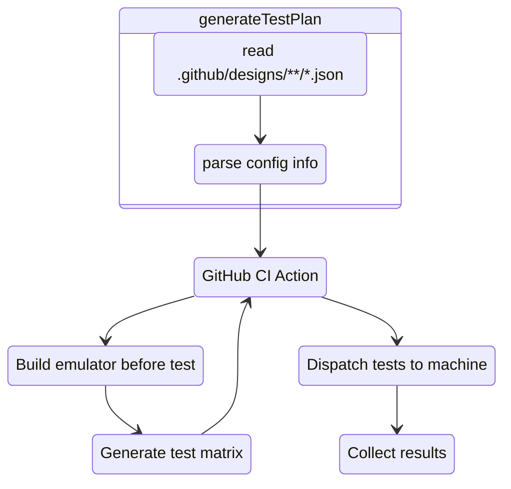

Current test flow
-----------------

```mermaid
stateDiagram-v2
    state "GitHub CI Action" as github_ci
    state generateTestPlan {
        state "read .github/designs/**/*.json" as read_config
        state "parse config info" as parse_config
        read_config --> parse_config
    }
    parse_config --> github_ci
    state "Build emulator before test" as prebuild_emulator
    github_ci --> prebuild_emulator
    state "Generate test matrix" as generate_matrix
    prebuild_emulator --> generate_matrix
    generate_matrix --> github_ci
    state "Dispatch tests to machine" as run_test
    github_ci --> run_test
    state "Collect results" as report
    run_test --> report
```
