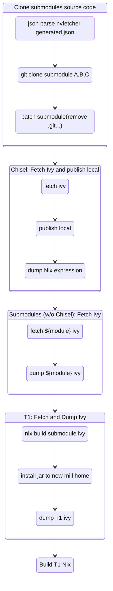

# Dirty Nix bootstrap steps

```mermaid
stateDiagram-v2
    state "Clone submodules source code" as clone_submodules {
        state "json parse nvfetcher generated.json" as parse_json
        state "git clone submodule A,B,C" as git_clone
        state "patch submodule(remove .git...)" as clean_repo
        parse_json --> git_clone
        git_clone --> clean_repo
    }

    state "Chisel: Fetch Ivy and publish local" as bootstrap_chisel {
        state "fetch ivy" as fetch_chisel_ivy
        state "publish local" as publish_chisel_local
        state "dump Nix expression" as dump_chisel
        fetch_chisel_ivy --> publish_chisel_local
        publish_chisel_local --> dump_chisel
    }

    state "Submodules (w/o Chisel): Fetch Ivy" as fetch_submodules {
        state "fetch ${module} ivy" as fetch_ivy
        state "dump ${module} ivy" as dump_ivy
        fetch_ivy --> dump_ivy
    }

    state "T1: Fetch and Dump Ivy" as bootstrap_t1 {
        state "nix build submodule ivy" as build_nix
        state "install jar to new mill home" as install_jar
        state "dump T1 ivy" as dump
        build_nix --> install_jar
        install_jar --> dump
    }

    clone_submodules --> bootstrap_chisel
    bootstrap_chisel --> fetch_submodules
    fetch_submodules --> bootstrap_t1

    state "Build T1 Nix" as build_t1_nix
    bootstrap_t1 --> build_t1_nix
```
