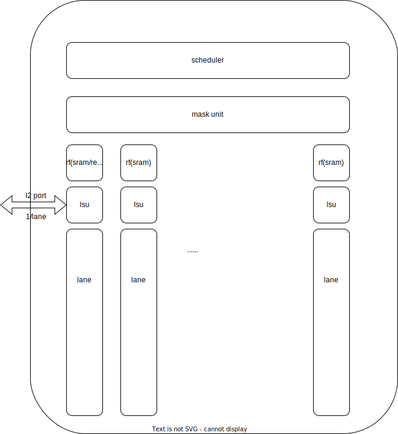

# 大框图

# permutation 类型指令

* mv: 标量与向量之间的移动,直接走lane0就好了.
* slide: 排队走数据总线
* gather:先过mask判断是否需要操作, 然后过alu与max vlen比较, 成功后再反馈给scheduler去重新访问rf, 然后通过数据总线交换数据到相应的lane里, 最后写到rf里面去,如果max vlen比较能搞定,可以直接放mask Unit里.
* (de)compress:考虑直接在mask unit里面做
* vr move: 这个直接先读后写就好了

# mask 类型指令

* mask rigister logical: 当成正常的指令直接在alu里面做
* Vector count population: 也放lane里面做, 然后走reduce + 的通路把count累加
*  find- first-set (vfirst.m rd, vs2, vm): 纠结是放lane里面做还是在mask unit里面做
* set before/including/only first: 分lane做, 分两部分: 找到第一个含有1的sew并处理好, 写进vd; 按mask填写剩余部分.
* vid: 这个直接读param的index拼上分组的index 写回 vd就好了
* iota: mask unit 里面做就好了